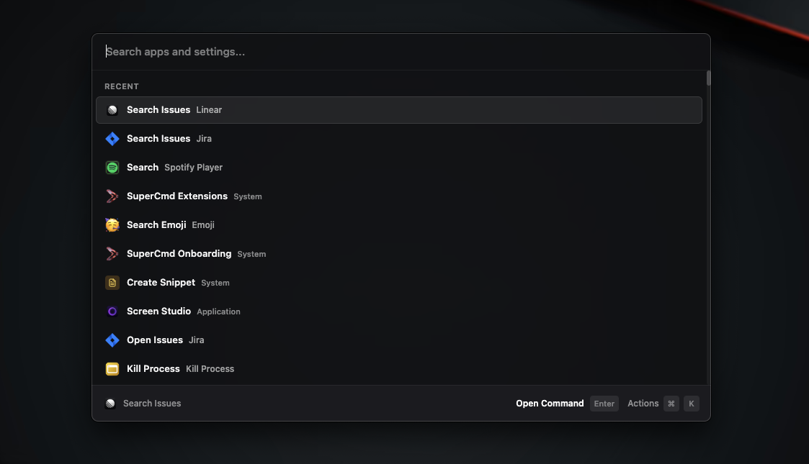

<div align="center">
<p align="center">
  
</p>

<h1 align="center"><b>SuperCmd</b></h1>
<h4 align="center">Raycast + Wispr Flow + Speechify + Memory + AI</h4>

<p align="center">
  <a href="https://supercmd.sh"></a>
  <a href="https://www.electronjs.org/"></a>
  <a href="http://makeapullrequest.com"></a>
</p>

<p align="center">Open-source launcher for macOS with Raycast-compatible extensions, voice workflows, and AI-native actions.</p>
</div>



Open-source launcher for macOS: **Raycast + Wispr Flow + Speechify + Memory + AI** in one app.

SuperCmd gives you Raycast-style extension workflows, hold-to-speak dictation, natural text-to-speech, and AI actions backed by configurable providers and memory.

## What It Is

SuperCmd is an Electron + React launcher that focuses on Raycast extension compatibility while remaining community-driven and open source.

## Key Features

- Raycast extension compatibility runtime (`@raycast/api` and `@raycast/utils` shims)
- Extension discovery/install/update flow
- Script command support
- **Wispr Flow-style** voice input: hold to speak, release to type
- **Speechify-style** read-aloud flow for selected text
- **Memory-aware AI** support (Supermemory integration)
- AI integrations (Ollama / OpenAI / Anthropic / ElevenLabs for speech)
- Native macOS helpers (hotkeys, color picker, speech, snippet expansion)

## Tech Stack

- Electron (main process)
- React + Vite (renderer)
- TypeScript
- Swift binaries for macOS-native integrations

## Project Structure

```text
src/main/        Electron main process, IPC, extension execution, settings
src/renderer/    React UI + Raycast compatibility layer
src/native/      Swift native helpers
extensions/      Installed/managed extension data
dist/            Build output
```

## How To Run

### Prerequisites

- macOS (required for native Swift modules)
- Node.js 18+
- npm
- Xcode Command Line Tools (`swiftc` available)

### Install

```bash
npm install
```

### Development

```bash
npm run dev
```

This starts:

- TypeScript watch for main process
- Vite dev server for renderer
- Electron app in development mode

### Build

```bash
npm run build
```

### Package App

```bash
npm run package
```

Output artifacts are generated under `out/`.

## AI + Memory Setup (Detailed)

You can configure everything from the app UI:

1. Launch SuperCmd.
2. Open **Settings**.
3. Go to **AI** tab.
4. Turn AI on (`enabled = true` in settings).
5. Pick your default provider (`OpenAI`, `Claude`, or `Ollama`).
6. Add the required key(s) and model settings.

### Provider keys

- OpenAI: set `openaiApiKey`
- Anthropic (Claude): set `anthropicApiKey`
- Ollama: set `ollamaBaseUrl` (default `http://localhost:11434`)

### Speech / voice-related keys

- ElevenLabs (for STT/TTS options): set `elevenlabsApiKey`
- Built-in Edge TTS option does not require an API key

### Memory keys

- Supermemory API key: `supermemoryApiKey`
- Supermemory client id: `supermemoryClient`
- Supermemory base URL: `supermemoryBaseUrl` (default `https://api.supermemory.ai`)
- Optional local mode: `supermemoryLocalMode`

### Where settings are stored

All app settings (including AI keys) are persisted in:

`~/Library/Application Support/SuperCmd/settings.json`

Important fields inside `settings.json`:

```json
{
  "ai": {
    "enabled": true,
    "provider": "openai",
    "openaiApiKey": "",
    "anthropicApiKey": "",
    "elevenlabsApiKey": "",
    "supermemoryApiKey": "",
    "supermemoryClient": "",
    "supermemoryBaseUrl": "https://api.supermemory.ai",
    "supermemoryLocalMode": false,
    "ollamaBaseUrl": "http://localhost:11434",
    "defaultModel": "openai-gpt-4o-mini",
    "speechToTextModel": "native",
    "textToSpeechModel": "edge-tts"
  }
}
```

### Optional environment variable fallbacks

- `ELEVENLABS_API_KEY`
- `SUPERMEMORY_API_KEY`
- `SUPERMEMORY_CLIENT`
- `SUPERMEMORY_BASE_URL`
- `SUPERMEMORY_LOCAL`

## Contributing

1. Fork the repository and create a feature branch.
2. Keep compatibility with existing Raycast extensions.
3. Follow current code organization:
   - API/runtime work in `src/renderer/src/raycast-api/`
   - System-level logic in `src/main/`
   - UI views/hooks in `src/renderer/src/`
4. Run build checks before opening a PR:

```bash
npm run build
```

5. In your PR, include:
   - What changed
   - Why it changed
   - Compatibility impact (if any)
   - How you tested it

## What's Pending

Current pending/roadmap items:

- Complete OAuth implementation in the Raycast API compatibility layer
- Expand `BrowserExtension` support beyond current stubs
- Improve selected text/Finder item behavior with macOS permissions handling
- Harden asset loading/path resolution for extension assets
- Add a broader automated test suite (unit + integration + compatibility)
- Continue parity work for edge-case Raycast APIs and behaviors

## Useful Commands

```bash
npm run dev            # Start local development
npm run build          # Build main, renderer, and native modules
npm run build:main     # Build Electron main process TS
npm run build:renderer # Build renderer with Vite
npm run build:native   # Compile Swift helpers
npm run package        # Build and package app with electron-builder
```

## References

- Raycast API docs: https://developers.raycast.com/api-reference/
- Raycast extension store: https://www.raycast.com/store
